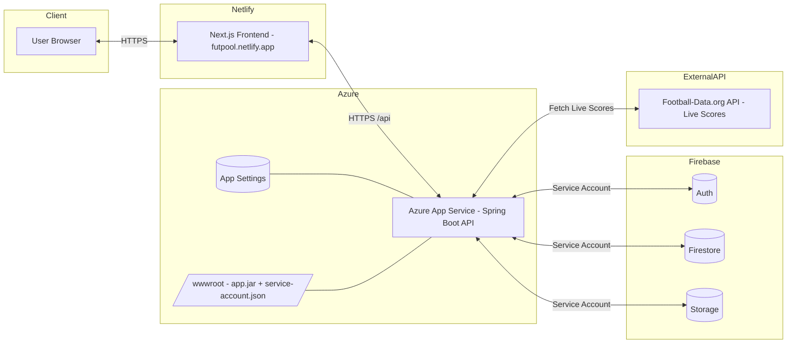

# ⚽Prototype [FutPool](https://futpool.netlify.app) - Futbol - Friends Prediction Pools 
[https://futpool.netlify.app/](https://futpool.netlify.app)
A full-stack web application to create, join, and manage football tournaments, predict match scores, and track user performance in real-time.

---

## 🚀 Tech Stack

- **Frontend:** [Next.js](https://nextjs.org/) + [TypeScript](https://www.typescriptlang.org/)
- **Auth & DB:** [Firebase Auth](https://firebase.google.com/products/auth) + [Cloud Firestore](https://firebase.google.com/products/firestore)
- **Backend:** [Spring Boot (Java)](https://spring.io/projects/spring-boot) hosted on Azure App Service
- **Styling:** [Tailwind CSS](https://tailwindcss.com/)
- **State Management:** Redux Toolkit
- **Routing:** Next.js App Router
- **APIs:** Football match data (via external football APIs)

---

## 📦 Features

- 🔐 Firebase Authentication (Google, Email/Password)
- 🏆 Create & Join Tournaments
- 📝 Make Predictions for Matches
- ✅ Auto-evaluate predictions after match end
- 💾 Save predictions with visual loading state
- 📊 Real-time Scoreboard & Stats
- 📥 Join Request System with Approval Flow
- 📱 Mobile-Responsive Design with Burger Menu
- 🦴 Skeleton Loaders for loading UI states
- ⚠️ Error Handling with friendly retry prompts
- 🍞 Toast Notifications for user feedback (react-hot-toast)
- 📑 Pagination for match listing
- 🌐 Role-based views (Public Stats, Private Dashboards)

---

## 🏗️ Infrastructure & Deployment

### Architecture Diagram

## 📡 Backend (Spring Boot)

The backend should expose endpoints like:

- `GET /api/users/{uid}`
- `POST /api/users`
- `GET /api/tournament/get/{id}`
- `POST /api/tournament/create`
- `GET /api/matches`
- `POST /api/predictions`

> Configure CORS, JWT Firebase token verification, and connect to Firestore.

---

## 📲 Responsive UI Design

- Customizable colors with CSS variables in `tailwind.config.js`
- Burger menu for mobile view
- Top bar shows login/profile/logout based on auth state

---

## 🧪 Testing

- Unit tests with Jest and React Testing Library (WIP)

---

## 📄 License

MIT License

---

## 🤝 Contributing

Pull requests are welcome. For major changes, open an issue first to discuss what you’d like to change.

---

## 🙌 Acknowledgements

- Firebase
- Spring Boot
- Football-Data.org API
- Tailwind CSS

